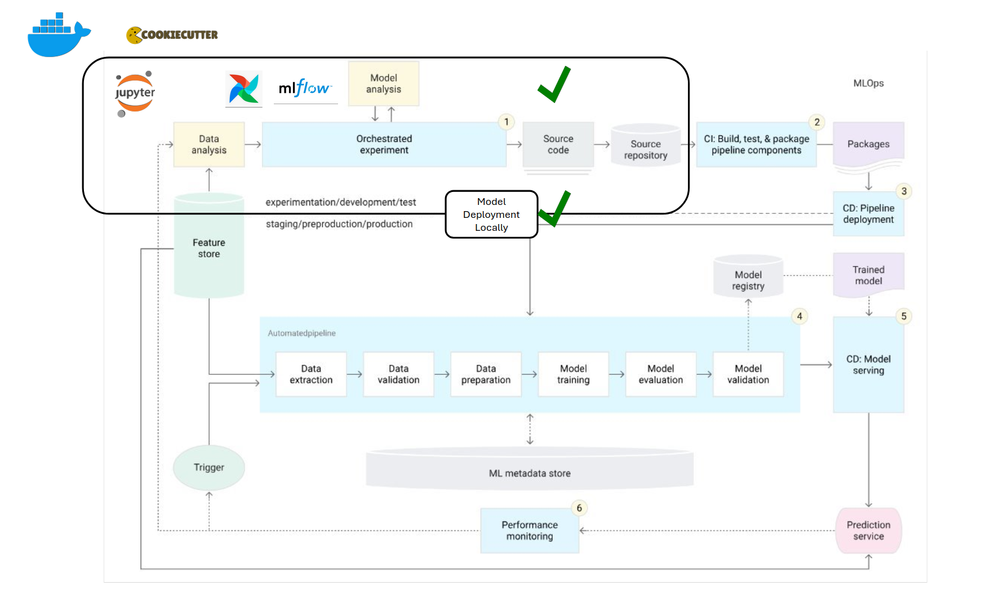

# Terraflow: MLOps Project Template

[](https://github.com/bcdev/terraflow/actions/workflows/unittest.yml)


TerraFlow combines "Terra" (Latin for Earth) and "Flow" (signifying seamless automation), 
representing a MLOps tool that streamlines the flow of geospatial data and machine learning 
models for Earth Observation. Just as Airflow automates workflows and MLflow manages ML 
lifecycles, TerraFlow would orchestrate the entire pipeline for remote sensing ML-based 
projects.

It is a comprehensive template (_in-development_) for machine learning projects
incorporating MLOps practices using `Airflow`, `MLFlow`, `JupyterLab` and `Minio`.


The architecture below describes what we want to achieve as our MLOps framework.
This is taken from the [Google Cloud Architecture Centre](https://cloud.google.com/architecture/mlops-continuous-delivery-and-automation-pipelines-in-machine-learning#mlops_level_2_cicd_pipeline_automation)

Currently what we support is the within the box outlined as local MLOps.



**Please note**: 
This template has only been tested on Linux Ubuntu and it works as expected.
As we have not tested it yet on Windows, we are not sure if it works in there.


## Overview

This template provides a standardized project structure for ML initiatives at BC,
integrating essential MLOps tools:
- **Apache Airflow**: For orchestrating ML pipelines and workflows
- **MLflow**: For experiment tracking and model registry
- **JupyterLab**: For interactive development and experimentation
- **MinIO**: For local object storage for ML artifacts

## Project Structure

Currently, any files or folders marked with `*` are off-limits—no need to change, modify, 
or even worry about them. Just focus on the ones without the mark!
```
├── .github/            # GitHub Actions workflows *
├── dags/               # Airflow DAG definitions (still in progress, you have to modify it a bit for now)
├── notebooks/          # JupyterLab notebooks
├── src/                  (For new projects, it would be good to follow this standardized folder structure
                            You are of course allowed to add anything you like to it.)
│   ├── train/          # Model training
│   ├── preprocess/     # Feature engineering
│   ├── postprocess/    # Postprocess model output
│   └── utils/          # Utility functions
├── tests/              # Unit and integration tests
├── mlflow-artifacts/   # MLflow artifacts (created if you don't choose minio) *
├── mlops_run.sh        # Shell script to start MLOps services locally *
├── docker-compose.yml  # Docker compose that spins up all services locally for MLOps *
├── pipeline-config.yml # Configure your airflow DAGs (support in future)
├── environment.yml     # Libraries required for local mlops and your project
└── dockerfiles/        # Dockerfiles and compose files *
```

## ML Pipeline Overview
## Components

### 0. Cookiecutter
Purpose: Project scaffolding and template generation

    Provides a standardized way to create ML projects with predefined structures.
    Ensures consistency across different ML projects within BC


### 1. Apache Airflow

Purpose: Workflow orchestration

    Manages and schedules data pipelines.
    Automates end-to-end ML workflows, including data ingestion, training, deployment and re-training.
    Provides a user-friendly web interface for tracking task execution's status.

### 2. MLflow

Purpose: Experiment tracking and model management

    Tracks and records machine learning experiments, including hyperparameters, performance metrics, and model artifacts.
    Facilitates model versioning and reproducibility.
    Supports multiple deployment targets, including cloud platforms, Kubernetes, and on-premises environments.

### 3. JupyterLab

Purpose: Interactive development environment

    Provides an intuitive and interactive web-based interface for exploratory data analysis, visualization, and model development.

### 4. MinIO

Purpose: Object storage for ML artifacts

    Acts as a cloud-native storage solution for datasets and models.
    Provides an S3-compatible API for seamless integration with ML tools.

## Getting Started

### Prerequisites

- [Docker](https://docs.docker.com/engine/install/) and [Docker Compose](https://docs.docker.com/compose/install/)
- [Python 3.12](https://anaconda.org/conda-forge/python/files?sort=length&type=&version=3.12.0&sort_order=desc&channel=main)
- [Mamba](https://github.com/conda-forge/miniforge)
- [Cookiecutter](https://cookiecutter.readthedocs.io/en/stable/installation.html#install-cookiecutter)

### Installation

1. Generate the project from template:
```bash
  cookiecutter https://github.com/bcdev/terraflow
```

1.1. When prompted for input, enter the details requested. If you dont provide any 
input for a given choice, the first choice from the list is taken as the default.


2. Create and activate mamba environment.
You can update the `environment.yml` to include your libraries, or you can 
update them later as well.
```bash
  mamba env create
  mamba activate <your-env-name>
```

If you have created an environment using the steps above, and would like to 
update the mamba env after adding new libraries in `environment.yml`, do this:
```bash
  mamba env update
```

3. Start the services:
```bash
  chmod +x mlops_run.sh
```
```bash
  ./mlops_run.sh -b -c
```
The following flags exist which could alter the behaviour of the way the framework 
runs, but the user should not worry about it or change them if not needed.
```commandline
-c -> to build docker images without cache
-j -> to change the port of jupyter lab instance running; defaults to 8895
-v -> to delete attached volumes when shutting down
-b -> to build the docker images before starting the containers
```

4. Stopping the services:

You should stop these container services when you're done working 
with your project, need to free up system resources, or want to apply some updates.
To gracefully stop the services, run this in the terminal where you started them:
```bash
  ctrl + C
```

### Accessing the services

Wait for the services to start (usually take 2-3 mins, might take longer if you start it without cache)

- Airflow UI: http://localhost:8080
  - Login Details:
    - username: `admin`
    - password: `admin`
- MLflow UI: http://localhost:5000
- JupyterLab: Opens up JupyterLab automatically at port 8895
- Minio (Local S3): http://localhost:9000
  - Login Details:
    - username: `minio`
    - password: `minio123`

## Key concepts
### Airflow UI
- **DAGs (Directed Acyclic Graphs)**: A workflow representation in Airflow. You can enable, disable, and trigger DAGs from the UI.
- **Graph View**: Visual representation of task dependencies.
- **Tree View**: Displays DAG execution history over time.
- T**ask Instance**: A single execution of a task in a DAG.
- **Logs**: Each task's execution details and errors.
- **Code View**: Shows the Python code of a DAG.
- **Trigger DAG**: Manually start a DAG run.
- **Pause DAG**: Stops automatic DAG execution.

Common Actions

- **Enable a DAG**: Toggle the On/Off button.
- **Manually trigger a DAG**: Click Trigger DAG ▶️.
- **View logs**: Click on a task instance and select Logs.
- **Restart a failed task**: Click Clear to rerun a specific task.

### MLFlow UI
- **Experiments**: Group of runs tracking different versions of ML models.
- **Runs**: A single execution of an ML experiment with logged parameters, metrics, and artifacts.
- **Parameters**: Hyperparameters or inputs logged during training.
- **Metrics**: Performance indicators like accuracy or loss.
- **Artifacts**: Files such as models, logs, or plots.
- **Model Registry**: Centralized storage for trained models with versioning.

Common Actions

- **View experiment runs**: Go to Experiments > Select an experiment
- **Compare runs**: Select multiple runs and click Compare.
- **View parameters and metrics**: Click on a run to see details.
- **View registered model**: Under Artifacts, select a model and click Register Model.

## Usage

### Development Workflow

1. In the JupyterLab that was opened up in your browser, navigate to the 
`notebooks` folder and create notebooks where you can experiment with your 
data, models and log metrics, params and artifacts to MLFlow. 
There are some example notebooks provided in the `examples` 
directory tp help you get started. If you chose MinIO as your local S3, use it 
to mimic API calls to real S3 to make sure all works when this goes into 
production.
2. Once you have your logic ready for the data ingestion, preprocessing and 
training, refactor it to production code in the `src/` directory.
3. Create tests in the `tests/` directory to test your data preprocessing 
methods and data schema etc. Make them green.
4. Create a new dag in the `dags` folder using the `example_dag.py` template provided.
**NOTE**: This will be simplified in the future.
5. Now you can see your DAG in the [Airflow UI](http://localhost:8080). 
You can trigger by clicking the 
`Trigger DAG ▶️` button. You can now view the logs of
your dag's execution and its status.
6. If you chose [MinIO](http://localhost:9000) (recommended) during the project 
initialization for MLFLow artifact storage, you can view them in the MinIO UI to
check if everything was generated correctly.
7. While the model is training, you can track the model experiments on the 
[MLFlow UI](http://localhost:5000).


### Deployment workflow

Once you have a model trained, you can deploy it locally either as
container or serve it directly from MinIO S3.
We recommend to deploy it as a container as this makes sure that it has its 
own environment for serving.

#### Deploying Model as a Container locally

Since we have been working with docker containers so far, all the environment 
variables have been set for them, but now as we need to deploy them,
we would need to export a few variables so that MLFLow has access to them and 
can pull the required models from MinIO S3.

```bash
  export MLFLOW_TRACKING_URI=http://127.0.0.1:5000 
  export MLFLOW_S3_ENDPOINT_URL=http://127.0.0.1:9000 
  export AWS_ACCESS_KEY_ID=mini
  export AWS_SECRET_ACCESS_KEY=minio12
```

Once we have this variables exported, find out the `run_id` of the model you 
want to deploy from the MLFlow UI and run the following command:

```bash
  mlflow models build-docker -m runs:/<run-id>/model -n <name-of-your-container> --enable-mlserver
```

After this finishes, you can run the docker container by:

```bash
  docker run -p 5002:8080 <name-of-your-container> 
```

Now you have an endpoint ready at `127.0.0.1:5002`.

Have a look at `notebooks/examples/mlflow_docker_inference.ipynb` for an 
example on how to get predictions


####  Deploying local inference server

Prerequisites

- [Pyenv](https://github.com/pyenv/pyenv-installer)
- Make sure standard libraries in linux are upto date.
  ```
  sudo apt-get update
  sudo apt-get install -y build-essential
  sudo apt-get install --reinstall libffi-dev
  ```
- Run these commands to export the AWS (Local Minio server running)
  ```bash
   export AWS_ACCESS_KEY_ID=minio 
   export AWS_SECRET_ACCESS_KEY=minio123
   export MLFLOW_S3_ENDPOINT_URL=http://127.0.0.1:9000
  ```
- Now we are ready for local inference server. Run this after replacing the required stuff
    ```bash
    mlflow models serve -m s3://mlflow/0/<run_id>/artifacts/<model_name> -h 0.0.0.0 -p 3333
    ```
- We can now run inference against this server on the `/invocations` endpoint,
- run `local_inference_test.py` after changing your input data.


## Configuration


## Acknowledgments

- [Cookiecutter](https://github.com/cookiecutter/cookiecutter)
- [Apache Airflow](https://airflow.apache.org/)
- [MLflow](https://mlflow.org/)
- [Minio](https://min.io/docs/minio/container/index.html)
- [JupyterLab](https://jupyterlab.readthedocs.io/)


## TODO:
- add pyproject.toml
- add license choice
- add starter tests within the template
- add github CI worklfow for testing
- add model deployment on remote server
- add trigger-based example dags
