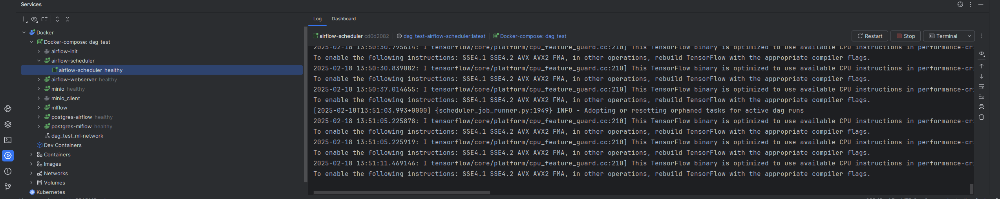

{{ cookiecutter.project_name|capitalize }}

## You made it!
Congratulations for making it here! You are on the right track :)

Please read or skim this completely before starting your journey.

If you face any issues or have any feedback, please share it with us.

## Project Structure

Any files or folders marked with `*` are off-limits—no need to change, modify, 
or even worry about them. Just focus on the ones without the mark!

Any files or folders marked with `#` can be extended, but carefully.
```
├── .github/             # GitHub Actions workflows (you are provided with a starter CI)
├── dags/                # Airflow DAG definitions 
│                          (you can either define dags using a config-file (dag-factory)
│                           or use Python scripts.)
├── notebooks/           # JupyterLab notebooks
├── {{ cookiecutter.package_name}}/                  
│   │                     (For new projects, it would be good to follow this standardized folder structure.
│   │                      You are of course allowed to add anything you like to it.)
│   ├── dataloader/      # Your Data loading scripts
│   ├── train/           # Your Model training scripts
│   ├── preprocess/      # Your Feature engineering/preprocessing scripts
│   ├── postprocess/     # Your Postprocessing model output scripts
│   ├── model/           # Your Model defintion
│   ├── model_pipeline/  # Your Model Pipeline to be used for inference
│   └── utils/           # Utility functions
├── tests/               # Unit and integration tests
├── data/                # If you have data locally, move it here and use it so that airflow has access to it.
├── README.md            # The one you are reading :p. Feel free to update it based on your project.
├── .env * #             # Your environment variables that docker compose and python scripts can use (already added to .gitignore)
├── environment.yml      # Libraries required for local mlops and your project
├── mlflow-artifacts/ *  # MLflow artifacts (created if you don't choose minio)
├── mlops_run.sh *       # Shell script to start MLOps services locally 
├── docker-compose.yml * # Docker compose that spins up all services locally for MLOps
└── dockerfiles/ *       # Dockerfiles and compose files
```

In your `{{ cookiecutter.package_name}}` package, you are provided with scripts
starting with `change_me_*`. Please have a look at the comments in these files
before starting.

If you chose to have examples for dags and ML package, you will find the files 
starting with `example_*`. Please have a look at these files to get more info 
and to get started.


## Getting Started with MLOps

Now that you have created a project using the template provided, please follow
the steps below to start your ML journey.

### 0. Git Fundamentals. 
First, we need to initialize a Git repository to make the initial commit.
```bash
  git init -b main
  git add .
  git commit -m "Initial commit"
```

Next, create a repository in Github. Once created, copy the remote repository 
URL. Open the terminal with this project as the current working directory.
Then, replace the REMOTE-URL with your repo's URL on Github
```bash
  git remote add origin REMOTE-URL
```
Verify if the remote URL was set correctly.
```bash
  git remote -v
```
To push the changes, do the following:
```bash
  git push origin main
```
Now you have created a git repository with an initial commit of this project.
To proceed, create a new branch and start working in it.
```
  git checkout -b name-of-your-branch
```

### 1. Create and activate mamba environment.

You can update the `environment.yml` to include your libraries, or you can 
update them later as well.
```bash
  mamba env create
  mamba activate <your-env-name>
```

If you have created an environment using the steps above, and would like to 
update the mamba env after adding new libraries in `environment.yml`, do this:
```bash
  mamba env update
```
To reflect these changes in Airflow as well, please restart the services as shown
in the next step.

### 2. Start the services:

The following script spins up containers for Airflow, MLFLow, MinIO (if you chose it)
and Jupyter Lab (not in a container).
```bash
  chmod +x mlops-run.sh
```
```bash
  ./mlops-run.sh -b
```
The following flags exist which could alter the behaviour of the way the framework 
runs, but the user should not worry about it or change them if not needed.
```commandline
-c -> to build docker images without cache
-j -> to change the port of jupyter lab instance running; defaults to 8895
-v -> to delete attached volumes when shutting down (beware! you will loose all your experiments and s3 minio data locally if you use this flag.)
-b -> to build the docker images before starting the containers
```

NOTE: When you run this for the first time, make sure you use the `-b` flag as it builds
the images for the first time as shown above.
Next time when you start it again, you start it without the flag as it saves 
time by not building the same images again:
```bash
  ./mlops-run.sh
```

### 3. Stopping the services:

You should stop these container services when you're done working 
with your project, need to free up system resources, or want to apply some updates.
To gracefully stop the services, run this in the terminal where you started them:
```bash
  ctrl + C
```

### 4. Accessing the services

Wait for the services to start (usually take 2-3 mins, might take longer if you start it without cache)

- Airflow UI: http://localhost:8080
  - Login Details:
    - username: `admin`
    - password: `admin`
- MLflow UI: http://localhost:5000
- JupyterLab: Opens up JupyterLab automatically at port 8895
- Minio (Local S3): http://localhost:9000
  - Login Details:
    - username: `minio`
    - password: `minio123`


## Development Workflow

1. Once the services start, the JupyterLab opens up in your browser. Now, 
navigate to the `notebooks` folder and create notebooks where you can experiment 
with your data, models and log metrics, params and artifacts to MLFlow. 
There are some starter notebooks provided in the `examples` folder which give
introduction on how to use MLFlow to track experiments and also how to perform 
inference on the MLFlow models. If you chose MinIO as your local S3, use it 
to mimic API calls to real S3 to make sure all works when this goes into 
production.
2. Once you have your logic ready for the data ingestion, preprocessing and 
training, refactor it to production code in the `src/` directory by modifying 
the files starting with `change_me_*`. If you chose to have the examples in the 
repository while creating this project, you will find files starting with 
`example_*`, which you can have a look for starting your refactor from Jupyter to
production code.
3. Create tests in the `tests/` directory to test your data preprocessing 
methods and data schema etc. Make them green.
4. Now you are ready to use Airflow. Look for `change_me_*` files inside the 
`dags` folder. These files will have comments on how to create DAGs.
If you chose to have the examples in the 
repository while creating this project, you will find files starting with 
`example_*`, use them to understand how DAGs are created to creat your own.
5. Now you can see your DAG in the [Airflow UI](http://localhost:8080). 
You can trigger by clicking the 
`Trigger DAG ▶️` button. You can now view the logs of
your dag's execution and its status.
6. If you chose [MinIO](http://localhost:9000) (recommended) during the project 
initialization for MLFLow artifact storage, you can view them in the MinIO UI to
check if everything was generated correctly.
7. While the model is training, you can track the model experiments on the 
[MLFlow UI](http://localhost:5000).
8. Once your model is finished training, you can now deploy it either using 
docker (recommended) or locally as shown in the next section.


## Deployment workflow

Once you have a model trained, you can deploy it locally either as
container or serve it directly from MinIO S3.
We recommend to deploy it as a container as this makes sure that it has its 
own environment for serving.

### Deploying Model as a Container locally

Since we have been working with docker containers so far, all the environment 
variables have been set for them, but now as we need to deploy them,
we would need to export a few variables so that MLFLow has access to them and 
can pull the required models from MinIO S3.

```bash
  export MLFLOW_TRACKING_URI=http://127.0.0.1:5000 
  export MLFLOW_S3_ENDPOINT_URL=http://127.0.0.1:9000 
  export AWS_ACCESS_KEY_ID=minio
  export AWS_SECRET_ACCESS_KEY=minio123
```

Once we have this variables exported, find out the `run_id` or the `s3_path` of the model you 
want to deploy from the MLFlow UI and run the following command:

```bash
  mlflow models build-docker -m runs:/<run-id>/model -n <name-of-your-container> --enable-mlserver --env-manager conda
```
or 
```bash
  mlflow models build-docker -m <s3_path> -n <name-of-your-container> --enable-mlserver --env-manager conda
```

After this finishes, you can run the docker container by:

```bash
  docker run -p 5002:8080 <name-of-your-container> 
```

Now you have an endpoint ready at `127.0.0.1:5002`.

Have a look at `notebooks/examples/mlflow_docker_inference.ipynb` for an 
example on how to get the predictions.


###  Deploying local inference server

Prerequisites

- [Pyenv](https://github.com/pyenv/pyenv-installer)
- Make sure standard libraries in linux are upto date.
  ```
  sudo apt-get update
  sudo apt-get install -y build-essential
  sudo apt-get install --reinstall libffi-dev
  ```
- Run these commands to export the AWS (Local Minio server running)
  ```bash
   export AWS_ACCESS_KEY_ID=minio 
   export AWS_SECRET_ACCESS_KEY=minio123
   export MLFLOW_S3_ENDPOINT_URL=http://127.0.0.1:9000
  ```
- Now we are ready for local inference server. Run this after replacing the required stuff
    ```bash
    mlflow models serve -m s3://mlflow/0/<run_id>/artifacts/<model_name> -h 0.0.0.0 -p 3333
    ```
- We can now run inference against this server on the `/invocations` endpoint,
- run `local_inference.py` after changing your input data.


## Accessing/Viewing these services in Pycharm

If you are a Pycharm user, you are amazing!

If not, please consider using it as it provides a lot of functionalities in its community version.

Now, let's use one of its features called Services. It is a small hexagonal button
with the play icon inside it. You will find it in one of the tool windows.

When you open it, you can add services like Docker and Kubernetes. But for this 
framework, we only need Docker.

To view the docker service here, first we need to install the Docker Plugin in Pycharm.

To do so, `PyCharm settings` -> `Plugins` -> Install Docker plugin from marketplace

Then, reopen the services window, and when you add a new service, you will find Docker.
Just use the default settings.

Now whenever you are running docker compose, you can view those services in this tab 
as shown below



## ❌ DO NOT MODIFY THESE FILES ❌

To maintain stability and consistency, please do not update or modify the following files:

- Dockerfiles
- mlops-run.sh
- docker-compose.yml

These files are essential for the proper functioning of the system. If changes 
are absolutely necessary, please consult the team and document the reasons clearly.

❗ Why You Shouldn't Change These Files mentioned above ❗

- Editing them may unleash chaos. Okay, maybe not chaos, but unexpected consequences!
- Your future self (and your teammates) will thank you. Trust us.
- It has been meticulously crafted to serve its purpose—no more, no less.

🤔 But What If I Really Need to Change It?

If you absolutely must make modifications, please:

1. Take a deep breath and be sure it’s necessary.
2. Consult your team (or at least leave a convincing justification in your commit message).
3. Triple-check that you aren’t breaking something sacred.
4. Proceed with caution and a great sense of responsibility.

